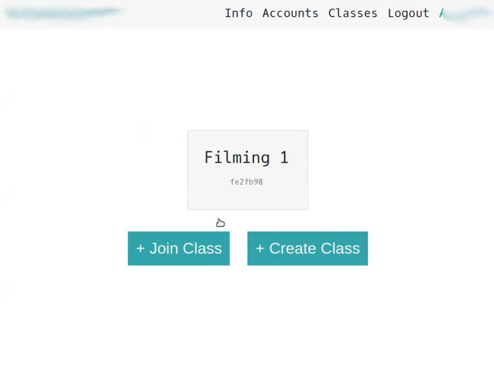
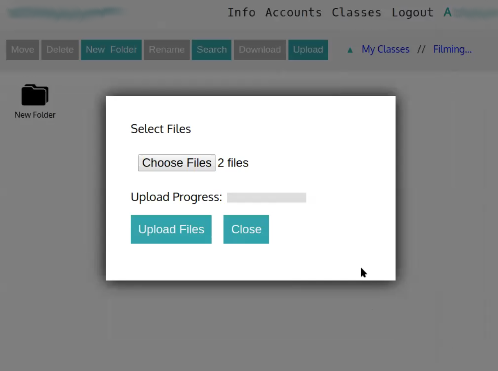

# Goggle Hive

My highschool project to make a Google Drive clone. Uses the good ol' LAMP (Linux, Apache, MySQL, PHP) stack and originally ran on Debian. All 4k lines were written entirely over an SSH connection with [ne](https://ne.di.unimi.it/), which is superior to vim. The PHP in this one might burn out your eyeballs, so wear safety goggles.

Gorgeous MySQL database UML diagram:

Glamour shots:

